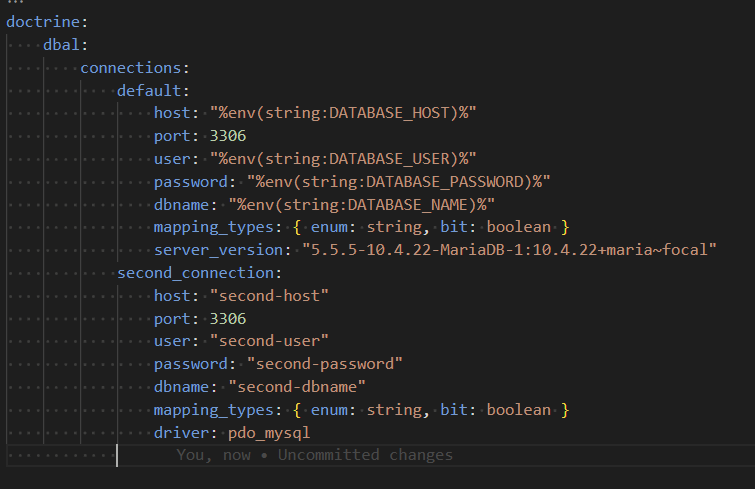

 
# Torq IT Data Importer Extensions

This extension adds a number of additional features to the [Pimcore Data Importer](https://github.com/pimcore/data-importer) bundle.

## Installation
```
composer require torqit/data-importer-extensions-bundle
```

## Path Syntax

A number of our extensions make use of the **Path** syntax that allows for Paths to be created based on values in the import. 

Take for example an Excel File:
| Year | Make | Model | Color |
| ---  | ---  | ---   | ---   |
| 2015 | GMC  | Sierra| White |
| 2001 | Chevrolet | Silverado | Blue |

To build the Path `/Products/Cars/GMC/Sierra/2015` using Path Syntax would be `/Products/Cars/$[1]/$[2]/$[0]`. The numerical values correspond to the indexes of the values in the Excel file (starting at 0).

For an XML file:

```
<Cars>
    <Car>
        <Make>GMC</Make>
        <Model>Sierra</Model>
        <Year>2015</Year>
        <Color>White</Color>
    </Car>
    <Car>
        <Make>Chevrolet</Make>
        <Model>Silverado</Model>
        <Year>2001</Year>
        <Color>Blue</Color>
    </Car>
</Cars>
```
the **Path Syntax** would use the Attribute names instead `/Products/Cars/$[Make]/$[Model]/$[Year]`

## Data Interpreters

Data Interpreters are the supported "File Formats" that the Data Importer bundle can use. We've added a few of our own.

### Advanced XLSX Interpreter

The Advanced XLSX interpreter makes a few improvements over the default XLSX interpreter.

This interpreter uses `openspout` as the Excel parser. Open Spout XLSX parsing uses **much** less memory than the default XLSX parses which makes use of `PHPOffice`. We've seen files that required >4GB RAM on PHPOffice use less than 50MB with openspout. We've also detected a memory leak in some cases with the PHPOffice implementation where RAM gets allocated on the server and never released.


| Configuration Option   | Description                                    | 
| ---------------------- | ---------------------------------------------- |
| Unique Column Indexes  | Accepts a comma separated list of column indexes to treat as unique values. Used to filter the rows in an excel file. For example an excel file with the headers `Brand,Model,SubModel` and you want to import a unique `Brand` object for each new `Brand` you encounter. In this case, use value `0` to only take unique values from the first column in the Excel file. If you want to create a data object for each `Brand` and `Model` use `0,1` as the value.                                           |
| Row Filter             | This accepts a [Symfony Expression](https://symfony.com/doc/current/reference/formats/expression_language.html) to be applied to the rows of the Excel file. Each row in the Excel file get's handed to the expression evaluator as a variable named `row`. The expression `row[0] == 'Apple'` would only process rows where the value of the first column is Apple.


### Bulk XLSX Interpreter

This Bulk XLSX Interpreter has the same options as the Advanced XLSX Interpreter. The main difference is that the Excel file gets converted to a CSV and loaded into the Data Importer queue using `LOAD LOCAL INFILE`. This **VERY DRASTICALLY** improves the performance of loading the queue table. We've seen 200K rows loaded in <5s. Our experience with a 16GB RAM server shows that Excel files over 30K rows often are not imported successfully by the default XLSX Interpreter.

**This Feature Requires the Database Server to be configured to permit local infile / infile permissions!**

See [MySQL Documentation](https://dev.mysql.com/doc/refman/8.0/en/load-data-local-security.html#load-data-local-configuration) regarding `LOCAL INFILE`.

Also in your database connection you'll need to add the Bulk option (1001:true) in example:

```
doctrine:
    dbal:
        connections:
            default:
                host: "%env(string:DATABASE_HOST)%"
                port: 3306
                user: "%env(string:DATABASE_USER)%"
                password: "%env(string:DATABASE_PASSWORD)%"
                dbname: "%env(string:DATABASE_NAME)%"
                mapping_types: { enum: string, bit: boolean }
                server_version: "5.5.5-10.4.22-MariaDB-1:10.4.22+maria~focal"
                options:
                    1001: true
```

### Bulk CSV Interpreter

The Bulk CSV Interpreter has the same options as the regular CSV interpreter but like the Bulk XLSX Interpreter it uses `LOAD LOCAL INFILE` to queue data rows. 
Please see the [Bulk XLSX Interpreter Section](#bulk-xlsx-interpreter) for limitions and requirments.

### Bulk SQL Interpreter 

This Interpreter is to be used when using the [Bulk SQL Data Loader](#bulk-sql-data-loader).
Behind the scenes this uses the Bulk CSV Interpreter as it is very fast. If you run into errors please see the [Bulk XLSX Interpreter Section](#bulk-xlsx-interpreter) for limitions and requirments.

### XML Schema Based Preview Interpreter

This Interpreter is an expansion upon the default XML based interpreter that will load all fields defined by the provided Xsd file for use in the preview screen.

## Data Loaders

### Bulk SQL Data Loader

As of 4.0 (and pimcore data-importer 1.10) This is an extended version of the default SQL data loader which uses the Bulk CSV implementation rather than the json implementation for better performance. Note that the pimcore JSON implementation will save mapping fields by name, which the Bulk SQL saves them by index so switching back and forth may break mappings.

The SQL Data Loader uses [DBAL](https://www.doctrine-project.org/projects/dbal.html) to allow data to be loaded from a SQL source. Connections to any database supported by DBAL will work provided they are configured correctly inside of `database.yaml`. (Database configuration can be placed in any valid Symfony config file, provided its in the correct format as can be seen in `database.yaml`). 

To set up a Bulk SQL loader

1. Create a new connection in `database.yaml` or if using the Pimcore database skip this step. 
2. Select the correct connection from the **Connection Name** dropdown
3. Provide a valid query using the Select, where, from, Group By, and Limit fields.
4. Ensure to select **Bulk SQL** under File Format! This loader produces a CSV file as part of loading the SQL.

## Data Targets

Data Targets control where data flows as its being mapped to Data Objects.

### Advanced Classification Store

This is the same as the [Classification Store](https://pimcore.com/docs/platform/Data_Importer/Configuration/Mapping_Configuration/Data_Target/#classification-store) Data Target except it adds the `Overwrite` options as seen on the `Direct` Data Target. 

### Image Gallery Appender

This can be used to add an image into an Image Gallery field.

### Property

This is used to set a property on a Data Object.

### Tags

This is used to add tags on a Data Object.


## Operators

### As Country Code

Operating on an input string that is expected to be either a 2- or 3- character Country Code, filters this input to the valid 2-character Country Code (or blank if none is found).

### Constants

This operator simply returns a constant string. Useful if wanting to control `OBJECT_TYPE` object or variant.

### SafeKey

This ensure that a value is cleaned to be a valid Key value.

### Import Asset Advanced

This allows two additional pieces of functionality when importing an asset:

**Path** Uses the **Path Syntax** described above to store the asset in a specified folder.

**URL Property** Specifies the name of the property on the asset to store the source URL the asset was captured from.

### Arithmetic

This allows you to apply addition, subtraction, multiplication, or division with a defined constant and your value.

### Regex Replace

This allows you to do string replaces using [preg_replace](https://www.php.net/manual/en/function.preg-replace.php)

## Element Loading

### Advanced Path Strategy

This allows loading objects using the **Path** syntax described earlier in this ReadMe.

Using the example Excel file in the **Path** section you could load the Data Object at `/Products/Cars/GMC/Sierra/2015` using Path Syntax `/Products/Cars/$[1]/$[2]/$[0]`. 

### Property

This allows a data object to be loaded based on the value of a property stored on it.

**This assumes that the property value is unique**. If a non-unique value exists, it'll be a random object returned that matches the criteria.


## Element Creation

### Advanced Parent Strategy

This allows locating objects using the **Path** syntax described earlier in this ReadMe.

Using the example Excel file in the **Path** section you could create a Data Object with parent `/Products/Cars/GMC/Sierra/2015` using Path Syntax `/Products/Cars/$[1]/$[2]/$[0]`. 


# License

This bundle is licensed under the Pimcore Open Core License (POCL)
and is intended for use with Pimcore Platform 2025.1 and newer.

See LICENSE.md for full license text.
