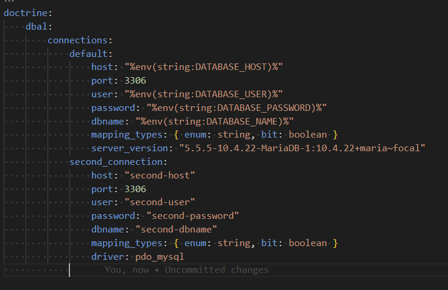

# Torq IT Data Importer Extensions

A Pimcore bundle that extends the official [Pimcore Data Importer](https://github.com/pimcore/data-importer)
with additional **interpreters, loaders, targets, operators, and resolution strategies** — built for real‑world
imports that the defaults struggle with (large files, deep object trees, schema‑driven XML, etc.).

If you have ever watched a 100K‑row XLSX import OOM your server, or wished you could build object paths
directly from column values, this bundle is for you.

## Table of contents

- [Highlights](#highlights)
- [Requirements](#requirements)
- [Installation](#installation)
- [Path Syntax](#path-syntax)
  - [Regex operations](#regex-operations)
- [Data Interpreters](#data-interpreters)
- [Data Loaders](#data-loaders)
- [Data Targets](#data-targets)
- [Operators](#operators)
- [Element Loading](#element-loading)
- [Element Creation](#element-creation)
- [License](#license)

## Highlights

| Capability | What it gives you |
| --- | --- |
| **Bulk XLSX / CSV / SQL interpreters** | Queue 200K+ rows in seconds using `LOAD LOCAL INFILE`. |
| **Advanced XLSX interpreter** | Streams large workbooks via `openspout` — gigabytes down to tens of MB of RAM. |
| **XML schema-based preview** | Discover all fields from an XSD up‑front, so the preview UI sees everything. |
| **Path Syntax** | Build object paths from row values (`/Products/Cars/$[Make]/$[Model]/$[Year]`), with inline regex. |
| **Row Filter** | Skip rows with a Symfony Expression — no preprocessing step required. |
| **Extra data targets** | Image Gallery appender, Object Property, Tags, and a Classification Store target with overwrite. |
| **Extra operators** | Arithmetic, regex replace, country‑code normalization, safe key, constants, advanced asset import. |
| **Advanced resolution** | Load and create objects by path or by property value. |

## Requirements

- PHP and Pimcore versions consistent with `pimcore/pimcore: ^12.0` and `pimcore/data-importer: ^2.0`
- For the bulk interpreters: MySQL/MariaDB with `LOCAL INFILE` enabled (see [Bulk XLSX Interpreter](#bulk-xlsx-interpreter))

This bundle targets **Pimcore Platform 2025.1 and newer**.

## Installation

```bash
composer require torqit/data-importer-extensions-bundle
```

Then enable the bundle (Pimcore will normally pick this up automatically because of the `extra.pimcore.bundles`
entry in `composer.json`; if not, register it in `config/bundles.php`):

```php
return [
    // ...
    TorqIT\DataImporterExtensionsBundle\TorqITDataImporterExtensionsBundle::class => ['all' => true],
];
```

Clear caches:

```bash
bin/console cache:clear
```

The new interpreters, loaders, targets, operators, and strategies will appear in the Data Importer UI.

## Path Syntax

Several extensions use a shared **Path Syntax** that constructs paths from row values.

Given the spreadsheet:

| Year | Make      | Model     | Color |
| ---- | --------- | --------- | ----- |
| 2015 | GMC       | Sierra    | White |
| 2001 | Chevrolet | Silverado | Blue  |

The Path Syntax `/Products/Cars/$[1]/$[2]/$[0]` resolves to `/Products/Cars/GMC/Sierra/2015`. The numbers are
zero‑based column indexes.

For XML sources, reference attribute / element names instead of indexes:

```xml
<Cars>
    <Car>
        <Make>GMC</Make>
        <Model>Sierra</Model>
        <Year>2015</Year>
        <Color>White</Color>
    </Car>
</Cars>
```

`/Products/Cars/$[Make]/$[Model]/$[Year]` resolves to the same path.

### Regex operations

Append one or more `{}` blocks to a column reference to transform the value. Blocks are applied left‑to‑right.

**Regex extract** — `{/pattern/flags}` returns the first capture group, or the full match if none.

```text
Category > Subcategory
$[0]{/^([^>]+)/}   →   "Category"
```

**Regex substitute** — `{s/pattern/replacement/flags}` performs a [`preg_replace`](https://www.php.net/manual/en/function.preg-replace.php).
Add the `g` flag to replace all occurrences.

```text
$[0]{s/ /-/g}              # replace all spaces with hyphens
$[0]{s/[^a-zA-Z0-9]//g}    # strip non‑alphanumerics
```

**Chaining** — combine blocks for multi‑step transforms:

```text
$[0]{/^([^>]+)/}{s/ /-/g}  # take text before ">", then hyphenate
```

## Data Interpreters

Interpreters are the file‑format readers exposed by the Data Importer.

### Advanced XLSX Interpreter

A drop‑in replacement for the default XLSX interpreter, backed by [`openspout`](https://github.com/openspout/openspout)
instead of PHPOffice. In our benchmarks, files that required **>4 GB** of RAM with PHPOffice processed in **<50 MB**
with openspout — and without the slow memory leak we observed in the default implementation.

| Configuration option | Description |
| --- | --- |
| **Unique Column Indexes** | Comma‑separated list of column indexes used to deduplicate rows. For headers `Brand,Model,SubModel`, set `0` to import one row per unique `Brand`, or `0,1` to import one row per unique `Brand`+`Model`. |
| **Row Filter** | A [Symfony Expression](https://symfony.com/doc/current/reference/formats/expression_language.html) evaluated against each row, exposed as the variable `row`. Example: `row[0] == 'Apple'` only processes rows whose first column is `Apple`. |

### Bulk XLSX Interpreter

Same options as the Advanced XLSX Interpreter, but the workbook is converted to CSV and loaded into the
Data Importer queue using `LOAD LOCAL INFILE`. This **drastically** improves queue load performance — we
routinely see **200K rows loaded in under 5 seconds**. On a 16 GB server, the default XLSX interpreter
frequently fails on files larger than ~30K rows; the Bulk interpreter does not.

> **Requires `LOCAL INFILE` to be enabled on the database server.**
> See the [MySQL documentation](https://dev.mysql.com/doc/refman/8.0/en/load-data-local-security.html#load-data-local-configuration).

You also need to set the `LOCAL INFILE` driver option (`1001: true`) on your Doctrine connection:

```yaml
doctrine:
    dbal:
        connections:
            default:
                host: "%env(string:DATABASE_HOST)%"
                port: 3306
                user: "%env(string:DATABASE_USER)%"
                password: "%env(string:DATABASE_PASSWORD)%"
                dbname: "%env(string:DATABASE_NAME)%"
                mapping_types: { enum: string, bit: boolean }
                server_version: "5.5.5-10.4.22-MariaDB-1:10.4.22+maria~focal"
                options:
                    1001: true
```

### Bulk CSV Interpreter

Same options as the default CSV interpreter, but queues rows via `LOAD LOCAL INFILE`. See the
[Bulk XLSX Interpreter](#bulk-xlsx-interpreter) section for requirements.

### Bulk SQL Interpreter

Pairs with the [Bulk SQL Data Loader](#bulk-sql-data-loader). Internally it uses the Bulk CSV path for
maximum throughput; same requirements as Bulk XLSX apply.

### XML Schema Based Preview Interpreter

Extends the default XML interpreter so that **every field declared in a provided XSD** is available in the
preview UI — even if it is missing from the sample file. Makes mapping XML feeds with sparse samples much
easier.

## Data Loaders

### Bulk SQL Data Loader

As of 4.0 (and Pimcore Data Importer 1.10), an extended version of the built‑in SQL Data Loader that uses
the Bulk CSV implementation instead of the JSON queue. It uses [Doctrine DBAL](https://www.doctrine-project.org/projects/dbal.html),
so any DBAL‑supported database works as long as it is configured in `database.yaml` (or any valid Symfony
config file using the same shape).

> **Mapping compatibility:** The default JSON‑based SQL loader saves mappings **by column name**, while the
> Bulk SQL loader saves them **by index**. Switching between them on an existing config may break field
> mappings.

To configure:

1. Add a new connection to `database.yaml`, or use the existing Pimcore connection.
   
2. Select the connection from the **Connection Name** dropdown.
3. Provide a valid query via the Select, From, Where, Group By, and Limit fields.
4. Set **File Format** to **Bulk SQL** — this loader produces a CSV file as part of loading.

## Data Targets

Data Targets control where mapped data is written on the target Data Object.

| Target | Purpose |
| --- | --- |
| **Advanced Classification Store** | Same as the built‑in [Classification Store](https://pimcore.com/docs/platform/Data_Importer/Configuration/Mapping_Configuration/Data_Target/#classification-store) target, plus the **Overwrite** options found on the **Direct** target. |
| **Image Gallery Appender** | Appends an image into an Image Gallery field. |
| **Property** | Sets a [property](https://pimcore.com/docs/platform/Pimcore/Objects/Object_Classes/Data_Types/Property_Types) on the Data Object. |
| **Tags** | Adds tags to the Data Object. |

## Operators

| Operator | Description |
| --- | --- |
| **As Country Code** | Given a 2‑ or 3‑character country code, returns the canonical 2‑character code (blank if invalid). |
| **Constants** | Returns a fixed string — handy for forcing `OBJECT_TYPE` or variant flags. |
| **SafeKey** | Cleans a string so it is valid as a Pimcore element key. |
| **Import Asset Advanced** | Like Import Asset, but adds **Path** (uses [Path Syntax](#path-syntax) to choose the storage folder) and **URL Property** (the property name on the asset where the source URL is stored). |
| **Arithmetic** | Add, subtract, multiply, or divide the value by a configured constant. |
| **Regex Replace** | String replacement via [`preg_replace`](https://www.php.net/manual/en/function.preg-replace.php). |

## Element Loading

Strategies for resolving an existing Data Object to update.

### Advanced Path Strategy

Loads a Data Object by a path built with [Path Syntax](#path-syntax). For the example sheet above,
`/Products/Cars/$[1]/$[2]/$[0]` loads `/Products/Cars/GMC/Sierra/2015`.

### Property

Loads a Data Object by the value of a property stored on it.

> **The property value is assumed to be unique.** If multiple objects match, an arbitrary one is returned.

## Element Creation

Strategies for choosing the parent path when a new Data Object must be created.

### Advanced Parent Strategy

Creates a Data Object under a parent path built with [Path Syntax](#path-syntax) —
e.g. `/Products/Cars/$[1]/$[2]/$[0]` creates the new object under `/Products/Cars/GMC/Sierra/2015`.

## License

This bundle is licensed under the **Pimcore Open Core License (POCL)** and is intended for use with
**Pimcore Platform 2025.1 and newer**. See [LICENSE.md](LICENSE.md) for the full text.
